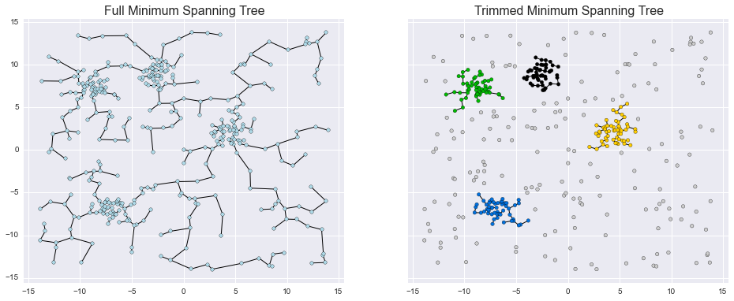

# Summary

This package contains a Python implementation of a clustering algorithm based
on an efficiently-constructed approximate Euclidean minimum spanning tree
(described in [@ivezic2014]). The method produces a Hierarchical clustering of
input data, and is quite similar to single-linkage Agglomerative clustering.
The advantage of this implementation is the ability to find significant clusters
even in the presence of background noise.

The code makes use of tools within SciPy [@scipy] and scikit-learn [@scikit-learn],
and is designed for compatibility with the scikit-learn API [@scikit-learn-api].

-

# References
